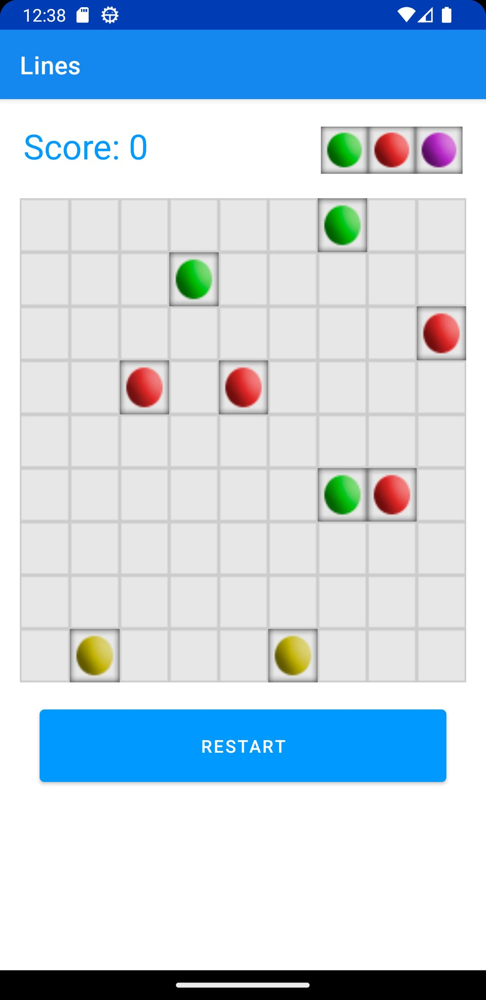

<div align = "center">

<h1><a href="https://2kabhishek.github.io/Lines2K">Lines2K</a></h1>

<a href="https://github.com/2KAbhishek/Lines2K/blob/main/LICENSE">
 </a>

<a href="https://github.com/2KAbhishek/Lines2K/graphs/contributors">
 </a>

<a href="https://github.com/2KAbhishek/Lines2K/stargazers">
</a>

<a href="https://github.com/2KAbhishek/Lines2K/network/members">
 </a>

<a href="https://github.com/2KAbhishek/Lines2K/watchers">
 </a>

<a href="https://github.com/2KAbhishek/Lines2K/pulse">
 </a>

<h3>The magic of Lines98, recreated 🕹️🟢</h3>

<figure>
  
  <br/>
  <figcaption>Lines2K screenshot</figcaption>
</figure>

</div>

## What is this

Lines2K is a recreation of the classic Lines 98 game for Android.

The goal of the player is to create vertical or horizontal lines of balls with the same colour, while the board keeps filling up with random balls.

## Inspiration

- Wanted to play this game on my phone and didn't find any ad free alternatives
- Had made [Kothello](https://github.com/2kabhishek/Kothello) sometime back, wanted to try my hands on another classic.

## Prerequisites

Before you begin, ensure you have met the following requirements:

- You have installed the latest version of `Android Studio`

## Getting Lines2K

To get Lines2K, follow these steps:

```bash
git clone https://github.com/2kabhishek/Lines2K
cd Lines2K
```

Open it up on Android Studio and then simply build it for your device or enjoy it on the emulator.

## How it was built

Lines2K was built using `Android Studio, Java and OSS`

## Challenges faced

- Building out the logic for the path checker was a bit tricky but googling helped.
- Faced some issues with gradle initially.

## What I learned

- Rediscovered this old gem and got to learn about it's internals.

## What's next

You tell me, PR's welcome.

Hit the ⭐ button if you found this useful.

## More Info

<div align="center">

<a href="https://github.com/2KAbhishek/Lines2K">Source</a> | <a href="https://2kabhishek.github.io/Lines2K">Website</a>

</div>
